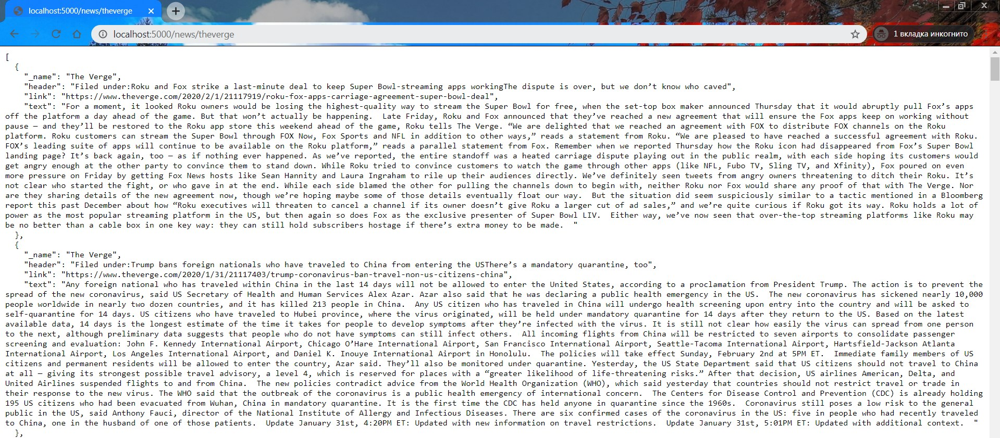

# News Aggregator
In today's world there are a huge number of different news sites and very little free time to switch between them.
News aggregator is a REST API service that, upon request, collects headings and texts of relevant articles from various news sites and gives them in JSON format.

Available News Sites:
* *dev.by*
* *theverge.com*
* *tech.onliner.by*

At the GET request __/news__ display news in the following format:


At the GET request __/news/site__, current news is exclusively provided by site ( /news/theverge ):



## Getting Started

These instructions will get you a copy of the project up and running on your local machine for development and testing purposes. 
See deployment for notes on how to deploy the project on a live system.

### Preparations...

What things you need to install the software and how to install them
```sh
  $ # Pre-installed Python 3
  $ # Create new Python virtual environment (<venv>)
  $ # Clone the repository to get the example code:
  $ git clone https://github.com/ZotovPhill/News-Aggregator.git
  $ # Install all dependencies inside virtual environment.
  $ pip install --user --requirement requirements.txt
```

### How To Use This...

1. Run python app.py
2. Navigate to http://localhost:5000 in your browser
3. Specify request by the following values:
   - __/news__ display articles of all following news sites
   - __/news/<site>__ display articles provided for specify <site> (dev.by, theverge, onliner)

## Testing application

A unit test is a smaller test, one that checks that a single component operates in the right way. A unit test helps to isolate what is broken in application and fix it faster.

### Running the tests

Application provided by multiple tests for each scraper:
```sh
$ python -m unittest scraper.tests.devby_test
$ python -m unittest scraper.tests.theverge_test
$ python -m unittest scraper.tests.onliner_test
```
And also simple test for Flask-service accessibility 
```sh
$ python -m unittest scraper.tests.flask_test
```

### Break down into the tests

Thats tests makes sure that data collected properly and and correctly displayed in web browser.
1. First test follows the specified link to the article and collect article title and text and compares with the original value.
2. Second test makes sure that service parce all links to the article presented on the main page


-----------


## And coding style

Using flake8 plugin for validating Python code style with the command line code formatting tool black. 
Black, “The Uncompromising Code Formatter”, is normally run to edit Python code in place to match their coding style, 
a strict subset of the PEP 8 style guide.

```sh
  $ pip install flake8
  $ pip install black
```
### Coding style tests

 Run flake8 over a scraper folder: 


## Additional details…

OOP style was used, so the following classes were created:
1) Article (news article)
2) SiteScraper (abstract article scraper)
3) SpecificSiteScraper (article-specific site scraper)
4) SiteScraperFactory (creator of scrapers (pattern factory): by name creates the corresponding scraper

For our purpose we also used Requests library (allows us to send HTTP/1.1 requests), and BeautifulSoup for pulling data out of HTML and XML files. Also Beautiful Soup sits on top of popular Python parsers html5lib.

## Built With

* [Python 3](https://www.python.org/) - The Main Programming Language
* [Flask (1.1.x)](http://flask.palletsprojects.com/en/1.1.x/) - REST API framework
* [Requests (2.22.0)](https://requests.readthedocs.io/en/master/) - Send HTTP/1.1 requests
* [Beautiful Soup (4.8.2)](https://www.crummy.com/software/BeautifulSoup/) - Dissecting HTML document and extracting data

## Authors

* **Phill Zotov** - [Assembly of various programs](https://github.com/ZotovPhill/Training_Repo)
* **Phill Zotov** - [JSON-Parser-EDI](https://github.com/ZotovPhill/JSON-Parser-EDI)

## Acknowledgments
* Thanks to the library developers for the clear and informative documentation
* Special thanks to Google and Stack for solving problems
* etc

